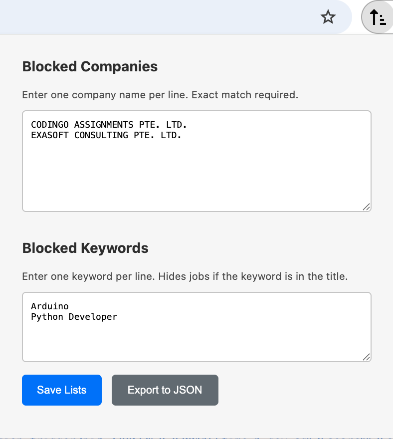

# Refine - A Web Content Filtering Extension

**Refine** is a lightweight and powerful browser extension that helps you clean up your web browsing experience. It allows you to create custom blocklists to hide unwanted content from job boards and other websites, letting you focus on what truly matters.

 

## ✨ Features

*   **Dual Blocklists:** Maintain separate, alphabetically sorted lists for blocking by **Company Name** (exact match) and by **Keyword** (hides if the keyword is found in the job title).
*   **Multi-Site Support:** Built on a scalable architecture designed to easily support multiple websites. Currently supports:
    *   MyCareersFuture Singapore
*   **Dynamic Content Handling:** Seamlessly filters content that is loaded dynamically as you scroll or navigate.
*   **Data Portability:** Export your blocklists to a JSON file for backup, and easily import them back.
*   **Lightweight & Fast:** Built with vanilla JavaScript, with no external frameworks or dependencies, ensuring minimal impact on browser performance.

## 🚀 Getting Started

1.  Clone this repository: `git clone https://github.com/your-username/refine-extension.git`
2.  Open Google Chrome and navigate to `chrome://extensions`.
3.  Enable **"Developer mode"** in the top right corner.
4.  Click **"Load unpacked"** and select the cloned project folder.
5.  The Refine icon will appear in your toolbar. Start blocking!

## 📋 To-Do & Future Features

This project is actively being developed. Here are some of the features planned for future releases:

*   [ ] **Context Menu Integration:** Right-click on text to quickly add it to a blocklist.
*   [ ] **Master Toggle:** A simple switch to temporarily disable all filtering.
*   [ ] **Broader Site Support:**
    *   [ ] LinkedIn
    *   [ ] Indeed
    *   [ ] Glassdoor
*   [ ] **Advanced Filtering:**
    *   [ ] Regular Expression (RegEx) support for keywords.
    *   [ ] Case-sensitivity toggle.
*   [ ] **UI Enhancements:**
    *   [ ] A dedicated options page for a more spacious UI.
    *   [ ] Display a badge count of items hidden on the current page.

## License

This project is licensed under the MIT License. See the [LICENSE](LICENSE) file for details.
